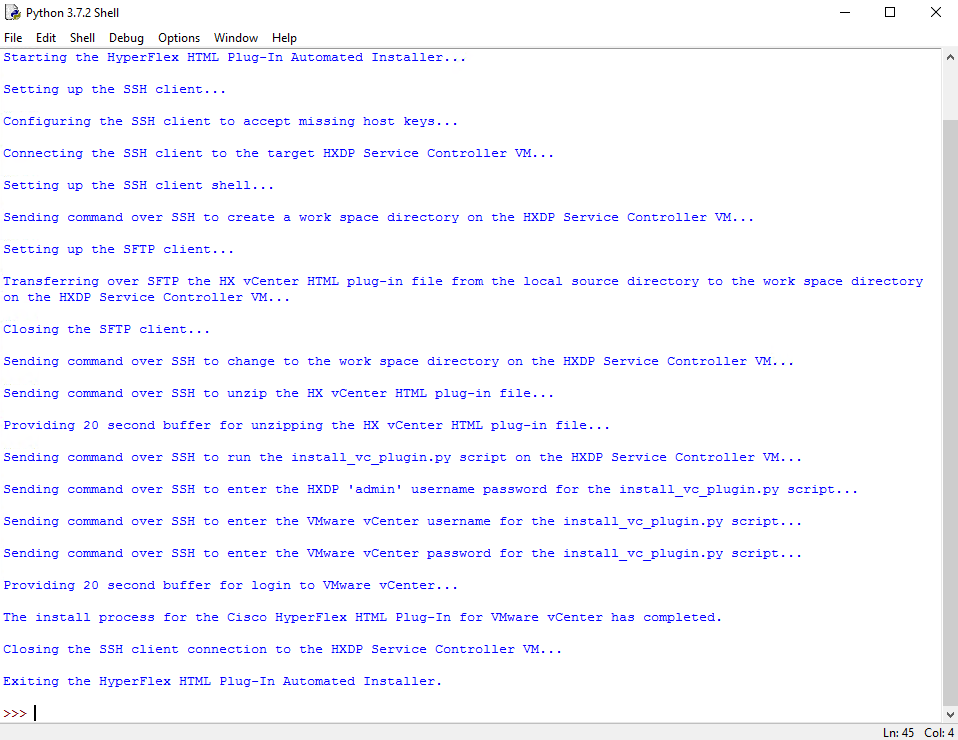

# HyperFlex HTML Plug-In Automated Installer

The HyperFlex HTML Plug-In Automated Installer automates installing the Cisco HyperFlex HTML Plug-In for VMware vCenter.

## Prerequisites:
1. Python 3 installed, which can be downloaded from [https://www.python.org/downloads/](https://www.python.org/downloads/).
2. Clone or download the HyperFlex HTML Plug-In Automated Installer repository by using the  link on the main repository web page or by running the following command:
    ```
    git clone https://github.com/ugo-emekauwa/hx-html-plugin-auto-installer
    ```
3. Install the required Python module **paramiko**. The requirements.txt file in the repository can be used by running the following command:
    ```
    python -m pip install -r requirements.txt
    ```
4. The IP address of one the service controller VMs on the targeted Cisco HyperFlex cluster.
5. User credentials with administrative rights on the targeted Cisco HyperFlex cluster.
6. The IP address of the targeted VMware vCenter managing the VMware ESXi hosts of the Cisco HyperFlex cluster.
7. User credentials with administrative rights on the targeted VMware vCenter.
8. A copy of the latest Cisco HyperFlex HTML Plug-In for VMware vCenter .zip file. This can be downloaded from the [Cisco Software Download Site](https://software.cisco.com/download/home/286305544/type/286305994/release).

## How to Use:
1. Please ensure that the above prerequisites have been met.
2. Open the **hx_vc_html_plugin_auto_installer.py** file in an IDE or text editor.
3. Go to the comment section named **Required Variables**, as shown below.
    ```python
    ######################
    # Required Variables #
    ######################
    ```
4. Set the value of the variable named `hx_vc_html_plugin_file_name` with the file name of the Cisco HyperFlex HTML Plug-In for VMware vCenter .zip file that was downloaded from the [Cisco Software Download Site](https://software.cisco.com/download/home/286305544/type/286305994/release). The value must be a string. For example, here is an entry that sets the file name to **HyperFlex-VC-HTML-Plugin-2.0.0.zip**:
    ```python
    hx_vc_html_plugin_file_name = "HyperFlex-VC-HTML-Plugin-2.0.0.zip"
    ```
5. Set the value of the variable named `hx_vc_html_plugin_local_directory` with the local directory path containing the Cisco HyperFlex HTML Plug-In for VMware vCenter .zip file. The value must be a string and appended with the slash or slashes appropriate to the operating system hosting the local directory. For example, here is an entry that sets the local directory on a Windows operating system to **c:\\Software\\**:
    ```python
    hx_vc_html_plugin_local_directory = "c:\\Software\\"
    ```
6. Set the value of the variable named `hxdp_remote_workspace_directory` with a remote directory path that will be created on one of the service controller VMs in the targeted Cisco HyperFlex cluster. This remote directory will be used to receive and unzip the Cisco HyperFlex HTML Plug-In for VMware vCenter .zip file. The value must be a string and appended with a forward slash appropriate to the Linux operating system of the service controller VMs. For example, here is an entry that sets the remote directory to **/home/admin/tmp_hx_vc_html_plugin_install/**:
    ```python
    hxdp_remote_workspace_directory = "/home/admin/tmp_hx_vc_html_plugin_install/"
    ```
7. Set the value of the variable named `hxdp_service_controller_vm_ip_address` with the IP address of one of the service controller VMs in the targeted Cisco HyperFlex cluster. The value must be a string. For example, here is an entry that sets the IP address to **198.18.135.103**:
    ```python
    hxdp_service_controller_vm_ip_address = "198.18.135.103"
    ```
8. Set the value of the variable named `hxdp_service_controller_vm_username` with the username of the credentials that will be used to access the targeted Cisco HyperFlex cluster. The value must be a string. For example, here is an entry that sets the username to **admin**:
    ```python
    hxdp_service_controller_vm_username = "admin"
    ```
9. Set the value of the variable named `hxdp_service_controller_vm_password` with the password of the credentials that will be used to access the targeted Cisco HyperFlex cluster. The value must be a string. For example, here is an entry that sets the password to **C1sco12345!**:
    ```python
    hxdp_service_controller_vm_password = "C1sco12345!"
    ```
10. Set the value of the variable named `vcenter_ip_address` with the IP address of the VMware vCenter managing the VMware ESXi hosts in the targeted Cisco HyperFlex cluster. The value must be a string. For example, here is an entry that sets the IP address to **198.18.133.30**:
    ```python
    vcenter_ip_address = "198.18.133.30"
    ```
11. Set the value of the variable named `vcenter_username` with the username of the credentials for the VMware vCenter managing the VMware ESXi hosts in the targeted Cisco HyperFlex cluster. The value must be a string. For example, here is an entry that sets the username to **administrator@vsphere.local**:
    ```python
    vcenter_username = "administrator@vsphere.local"
    ```
12. Set the value of the variable named `vcenter_password` with the password of the credentials for the VMware vCenter managing the VMware ESXi hosts in the targeted Cisco HyperFlex cluster. The value must be a string. For example, here is an entry that sets the password to **C1sco12345!**:
    ```python
    vcenter_password = "C1sco12345!"
    ```
13. Save and then run **hx_vc_html_plugin_auto_installer.py** directly from your IDE or from the command line e.g.:
    ```
    python hx_html_plugin_auto_installer.py
    ```
14. Here is an example of the output from **hx_vc_html_plugin_auto_installer.py** for a successfully completed installation of the Cisco HyperFlex HTML Plug-In.

    

    If the Cisco HyperFlex HTML Plug-In is already installed, the installer will automatically exit.

## Use Cases:
The HyperFlex HTML Plug-In Automated Installer is part of the automation solution used to support the following upcoming Cisco Data Center product demonstrations on Cisco dCloud:

1. _Cisco HyperFlex Edge 4.5 with Intersight v1 (All Flash, 3-Node)_
2. _Cisco HyperFlex Edge 4.5 with Intersight v1 (All Flash, 2-Node)_
3. _Cisco HyperFlex Edge 4.5 with Intersight v1 (Hybrid, 2-Node)_

Cisco dCloud is available at [https://dcloud.cisco.com](https://dcloud.cisco.com), where product demonstrations and labs can be found in the Catalog.

## Related Tools:
Here are similar tools to help deploy and manage Cisco HyperFlex.
- [HyperFlex Notification Tool for Cisco Intersight](https://github.com/ugo-emekauwa/hyperflex-notification-tool)
- [Cisco HyperFlex API Token Manager](https://github.com/ugo-emekauwa/hx-api-token-manager)
- [HyperFlex Edge Automated Deployment Tool for Cisco Intersight](https://github.com/ugo-emekauwa/hx-auto-deploy)

## Author:
Ugo Emekauwa

## Contact Information:
uemekauw@cisco.com or uemekauwa@gmail.com
